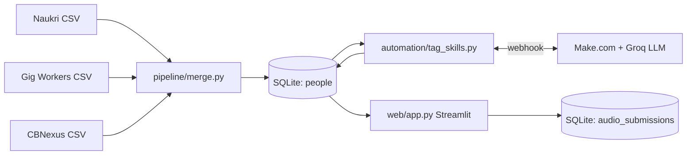

# ConsultBae — Data Merge & Automation

Three messy CSVs from three systems (recruitment applicants, gig workers, CBNexus contacts), with no
shared ID, merged into **one clean SQLite database of 56 unique people** — plus an LLM skill-tagging
automation (Task 2) and an audio-collection app (Task 3) built on top.

## Contents

1. [Setup and run](#setup-and-run)
2. [Skill tagging automation (Task 2)](#skill-tagging-automation-task-2)
3. [Audio collection app (Task 3)](#audio-collection-app-task-3)
4. [Data issues report](#data-issues-report)
5. [Stuck log](#stuck-log)
6. [Scaling note (Task 5)](docs/scaling.md) — one page: what breaks at 5,000 workers, and what I'd change


---

## How the pieces connect



Everything reads and writes one SQLite file, `db/consultbae.sqlite3`, so the whole thing is one connected
system — the audio app even links a new recording back to a person from Task 1 by phone number.


---

## Setup and run

Requires **Python 3.10+**.

```bash
# --- Setup ---
git clone https://github.com/mdataullah-dev/ai-automation-flow.git
cd ai-automation-flow
python -m venv .venv
.venv\Scripts\Activate.ps1          # Windows (PowerShell)  ·  mac/linux: source .venv/bin/activate
pip install -r requirements.txt

# --- Task 1: build the clean database (run this first) ---
python pipeline/merge.py

# --- Task 2: tag each person's skill category (Make + Groq) ---
#   needs GROQ_API_KEY and MAKE_WEBHOOK_URL in .env, and the Make scenario switched ON
python automation/tag_skills.py            # tag everyone not yet tagged
python automation/tag_skills.py --retag    # clear all tags and re-classify everyone
python automation/tag_skills.py --sample   # 2-person test to the webhook, no DB writes (setup/debug)

# --- Task 3: audio collection app (opens in the browser) ---
streamlit run web/app.py
```

Task 1 prints `103 staged → 60 clusters → 56 people` and writes `db/consultbae.sqlite3`. Tasks 2 and 3
both read and write that same database, so run the pipeline first.

---

## Skill tagging automation (Task 2)

A no-code **Make.com** automation that uses an LLM to tag each person with a skill category. The LLM step
runs **inside Make**, not in Python.

**Flow:** `tag_skills.py` reads untagged people → POSTs them to a Make **webhook** → Make calls **Groq**
(`gpt-oss-120b`) to classify → returns the result → `tag_skills.py` writes `skill_category` back to the
database.

The scenario is exported to
[`automation/make_scenario.blueprint.json`](automation/make_scenario.blueprint.json), importable into any
Make account with the Groq key scrubbed.

**Categories:** `automation-heavy`, `web-dev`, `data`, `ai-ml` — each person gets the group that holds the
most of their skills. Result on the 56 people (one has no skills, since CBNexus carries none, so 55 are
tagged):

```
web-dev  20    data  19    ai-ml  9    automation-heavy  7
```

Run `python automation/tag_skills.py` (or `--retag` to clear and re-classify everyone).

---

## Audio collection app (Task 3)

A **Streamlit** app where a gig worker submits a voice recording; the app measures the audio and stores it
in the same database. Run with `streamlit run web/app.py`.

Two tabs:
- **Submit** — enter name + phone, then **record in the browser** *or* **upload a file**. On submit the
  clip is saved, its properties are extracted, and a row is written to a new `audio_submissions` table.
- **All submissions** — every submission with a ▶ play button and its properties.

**Extracted for every clip:** duration, sample rate (kHz), bitrate (kbps), loudness (dB), plus a bonus
noise/quality estimate — all via the ffmpeg bundled by `imageio-ffmpeg` (no system install) and numpy.

**Ties back to Task 1:** the phone is normalised with the merge pipeline's `clean_phone`, so a submission
links to one of the 56 people when the phone matches. Clips are stored under `web/audio_files/`
(git-ignored — they are runtime data).

---

## Data issues report

The source files are deliberately messy. Rather than fix problems by hand, the pipeline **detects and
logs each one as it runs** and prints a summary at the end, so this report always matches what the code
actually does. Running `python pipeline/merge.py` reproduces every line number quoted below.

**Total: 23 issue instances across 14 distinct types.**

### Structural problems (broken rows)

| Where | Problem | Fix |
|-------|---------|-----|
| source2, line 20 | **Shifted row** — every column moved one place to the right; the name "Isha Chopra" ended up in the `rate` column | Detected (email sitting in the wrong column) and realigned to recover every field |
| source2, line 12 | **Blank row** (six empty fields) | Dropped |
| source3, line 16 | **Repeated header** row pasted into the middle of the data | Dropped |

### Inconsistent formats (same value, many encodings)

| Field | Problem | Fix |
|-------|---------|-----|
| Phone | 6 formats: `+91…`, `0…`, bare 10-digit, `91…`, `+91-…` | Strip non-digits, drop the country code / leading zero, keep the last 10 digits |
| City | 17 spellings of 5 cities, incl. trailing spaces (`Noida `) and renames (Gurgaon = Gurugram, Bangalore = Bengaluru) | Strip whitespace, then map to a canonical set of 5 |
| Applied date | 4 formats; dashes are day-first, slashes are month-first (8 values are ambiguous without this rule) | Parse by delimiter, normalise to ISO `YYYY-MM-DD` |
| CTC | mixes absolute rupees and lakhs in one column | Values below 100 are treated as lakhs and scaled up; stored as annual INR |
| Rate | mixes `NNNN/hr` and `NNk/month` | Amount and period stored separately (no invented conversion) |
| Email | about one third of source-2 emails are UPPERCASE | Lower-cased before matching |
| Verified | `Y` / `yes` / `Yes` / `N` / `No` | Normalised to `1` / `0` |

### Duplicates and identity

- **Duplicate inside one file:** `R. Verma` and `Rohit Verma` (source 1) share one email and one phone — an
  abbreviated-name duplicate, caught by exact identifiers. The full name is kept.
- **One person, two emails:** `Nikhil Chopra` has two emails on the same phone. Both are kept in the
  cluster; the cleaner one is chosen as primary and the duplicate is flagged, never dropped silently.
- **Cross-file matches:** four people (`Manish Bhatia`, `Divya Chopra`, `Karan Chopra`, `Vikram Mehta`)
  exist only in the email-only and phone-only files and are correctly merged on name and city.

### The ambiguous case (Arjun Mehta)

There are clearly at least two distinct Arjun Mehtas in Noida:

| Record | Email | Phone | Sources |
|--------|-------|-------|---------|
| A | `arjun.mehta9@…` | `9000000131` | Naukri + CBNexus (both agree) |
| B? | `arjun.mehta77@…` | — | Gig workers |
| C? | — | `9000000272` | CBNexus |

Record A is certain. Records B and C share only name and city — but that bucket is already proven **not**
unique (A is in it too), so B and C could be one person or two, and the data cannot tell which. The
pipeline refuses to guess: it keeps them separate and flags the case. This is why the final count is
**56, not 55** — the first draft merged all three and produced a record with one person's email next to
another person's phone.

### Why not fuzzy matching

The first attempt matched names with `fuzz.ratio > 85`. Measured on the real data it is impossible to
tune correctly:

| Pair | Score | Correct action |
|------|-------|----------------|
| `R. Verma` vs `Rohit Verma` | 77.8 | **merge** (same person) |
| `Arjun Mehta` vs `Arjun Mishra` | 78.3 | **do not merge** (different people) |

No threshold keeps the first and rejects the second, so fuzzy matching was removed entirely (along with
the `thefuzz` dependency). Matching relies on exact identifiers plus a guarded name-and-city rule.

---

## Stuck log

*The hardest places I got stuck, and exactly how I got out.*

### 1. Groq kept failing on the full batch of 55 people

- **Where I got stuck:** the Make scenario only said "Scenario failed to complete" — no detail. It
  classified 2 test people fine, but the real run of 55 failed every single time.
- **How I got unstuck:** I took the Groq call out of Make and ran it directly from Python to see the real
  error — `json_validate_failed`, with an empty response. That gave me something to search.
- **What I searched:** "groq json_validate_failed", and why a reasoning model returns empty JSON on a
  large request.
- **What I asked AI:** why Groq fails JSON validation only on the big batch when 2 people work fine. The
  answer: `gpt-oss-120b` is a reasoning model, and on 55 people at once it spends its whole token budget
  "thinking" before it writes the JSON, so nothing valid comes out.
- **What I rejected, and why:** my first fix was to raise `max_completion_tokens` to 8000 — that hit a
  "request too large" rate-limit wall on the free tier, so I dropped it. I used `reasoning_effort: "low"`
  with `max_completion_tokens: 3000` instead: enough room for the answer, safely under the limit.

### 2. The tagging ran, but the result was clearly wrong

- **Where I got stuck:** the tagger happily wrote all 55 tags — but 44 of them came back
  `automation-heavy`. 80% of people in one bucket is obviously wrong.
- **How I got unstuck:** I queried the database and read the actual people. The model was tagging anyone
  with a *single* automation tool (one Zapier) as automation-heavy, even people with five web-dev or data
  skills.
- **What I searched:** how to make an LLM classify by the *dominant* group instead of any single match,
  and prompt patterns for balanced classification.
- **What I asked AI:** why the model over-tagged automation, and how to word the prompt so it weighs the
  whole skill mix.
- **What I rejected, and why:** I rejected accepting the working-but-skewed output, and I rejected simply
  raising the reasoning effort (that brings back the JSON crash from #1). Instead I rewrote the prompt to
  count each person's skills per group and pick the biggest, with an explicit "one automation tool does
  not make you automation-heavy" rule and a tie-break order. The spread balanced out: web-dev 20, data 19,
  ai-ml 9, automation-heavy 7.

### 3. Extracting audio properties with no prior audio experience

- **Where I got stuck:** I had never worked with audio, and I needed duration, sample rate, bitrate, and
  loudness from arbitrary clips (browser recordings and uploads). The library I picked, `imageio-ffmpeg`,
  bundles ffmpeg but **not** ffprobe — so the usual "run ffprobe and read its JSON" route was unavailable.
- **How I got unstuck:** I read the sample rate, bitrate, and codec straight out of ffmpeg's own `-i`
  banner with a regex, then decoded the clip to raw audio samples and computed duration and loudness
  (RMS in dBFS) from the numbers with numpy.
- **What I searched:** how to read audio metadata using ffmpeg alone (without ffprobe), and how loudness
  in dBFS and a noise floor are actually calculated.
- **What I asked AI:** how to turn raw samples into a rough noise/quality score.
- **What tripped me up, and the fix:** my first quality score labelled *every* clip "poor". I realised my
  synthetic test tone had no silent gaps, so its "noise floor" equalled the signal itself. I re-tested
  with speech-like audio (loud parts plus silence) and it behaved correctly — clean clips scored "good",
  constant hiss scored "poor".
